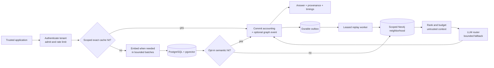
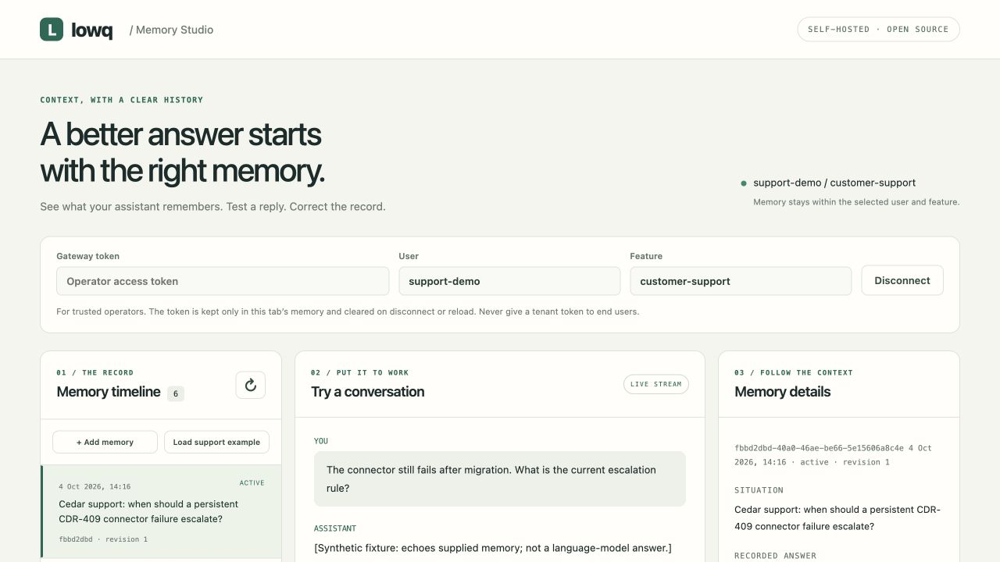

<div align="center">

# Lowq X2 · Contextual LLM Gateway

**Give repeated LLM requests scoped memory, traceable context, and measurable operating limits.**

[](https://github.com/kshubham090/contextual-llm-gateway/actions/workflows/ci.yml)
[](https://www.python.org/)
[](https://fastapi.tiangolo.com/)
[](docs/architecture.md)

[Memory Studio](#memory-studio-and-a-demo-without-provider-keys) · [SDKs](docs/integration.md) · [Architecture](docs/architecture.md) · [Use cases](docs/use-cases.md) · [Evaluation](docs/evaluation.md) · [Operations](docs/operations.md) · [Security](docs/security.md)

</div>

An LLM already knows general concepts. It usually does not know **your service's rollback caveat, your experiment's calibration rule, or your customer's previous connector issue**. This gateway retrieves related past interactions from a scoped graph and supplies them as context to the next request.

The core idea is unchanged: **traffic becomes retrievable memory**. PostgreSQL with pgvector finds related calls; Neo4j connects their neighborhoods; a bounded ranking stage selects context; an LLM answers; a durable event records new memory. Response metadata identifies the exact calls supplied to the model. These identifiers establish context provenance, not proof that an answer is correct.

This repository provides a hardened, testable foundation with measured local embedding improvements. Production readiness depends on the deployment, data policy, workload, and provider behavior. The [end-to-end report](docs/end-to-end-results.md) separately records CPU/MPS HTTP load tests with synthetic generation and a pinned local-model memory comparison, with raw results and limitations.

## What is implemented

| Concern | Behavior |
|---|---|
| Identity and memory | Bearer keys map to tenants. Cache reads, vector retrieval, and graph traversal are bounded by tenant, user, and feature. |
| Cache correctness | An indexed exact-prompt lookup runs before embedding, with generation configuration, token budget, and TTL checks. Semantic reuse requires an explicit request flag. |
| Durable memory | Billing and a graph event commit in one PostgreSQL transaction before success. A leased outbox worker projects events into Neo4j. |
| Failure control | Request limits, admission bounds, provider concurrency limits, timeouts, model fallback, and circuit breaking. |
| Efficient inference | Bounded embedding batches, reusable clients, a scoped TTL embedding cache, and optional local CPU/CUDA/MPS inference. |
| Memory control | Inspect, create, correct and forget scoped records. Revisions fence in-flight writes; dependent answers are retired and stale graph events cannot restore deleted content. |
| Streaming and integration | Native SSE and a documented text-only Chat Completions subset, with Python and TypeScript clients. Anthropic and configurable OpenAI-compatible generation backends. |
| Privacy control | `store: false` keeps prompt, response, embedding, and graph payload out of persistent memory and the embedding cache; content-free accounting remains. |
| Measurement | Request IDs, stage timing metadata, health/readiness probes, Prometheus metrics, synthetic evaluation fixtures, and a reproducible embedding benchmark. |

## Architecture



Graph memory can improve continuity when past interactions contain useful facts. It also adds retrieval work, prompt tokens, and potential stale or incorrect context. Measure those tradeoffs on the intended workload. For general one-off questions, use `use_graph: false`.

## Memory Studio and a demo without provider keys



Memory Studio is a same-origin operator interface at `/inspector`. Browse the selected user/feature timeline, stream an answer, inspect its exact source records, add verified facts, correct a stale rule, or forget memory and its derived answers. Tokens live only in the open tab; scope changes clear conversation drafts. Tenant tokens belong to trusted operators and application servers, never end users.

For a **fresh checkout**, use the local demo to try the entire workflow with real PostgreSQL, Neo4j, and Redis and explicitly synthetic inference:

```bash
python -m venv .venv
source .venv/bin/activate
pip install -r requirements-dev.txt
python scripts/setup_demo.py
docker compose up -d postgres neo4j redis
python scripts/demo_server.py
```

Open [Memory Studio](http://127.0.0.1:8001/inspector), enter the token from the key in `.env`'s `GATEWAY_API_KEYS`, connect, and choose **Load support example**. Ask what the returning customer should do next. Follow a source, change its escalation rule, and ask again. The replacement is active; the old memory and dependent answers lose their retained content.

The setup script refuses to overwrite an existing `.env`. The demo binds to loopback, uses no paid provider, and is excluded from the production image. Its text is a fixture that echoes context, **not a model-quality demonstration**. For real generation, configure a provider and start the normal app below. See [the complete walkthrough](docs/memory-studio.md).

## Quickstart with real inference

Requires Python 3.12+ for local scripts and Docker Compose v2. The defaults use Anthropic generation and Voyage embeddings. Alternatively configure an OpenAI-compatible generation server and optional local embeddings; see [provider configuration](docs/api-compatibility.md). Provider calls cost money. The fixture validator and unit tests do not need keys or running services.

```bash
python -m venv .venv
source .venv/bin/activate
pip install -r requirements-dev.txt
python scripts/evaluate.py validate
pytest -q
```

To start the gateway:

```bash
test -f .env || cp .env.example .env
python -c 'import secrets; print(secrets.token_hex(24))'
```

If you used the demo, preserve its existing database passwords and gateway tokens; add provider settings to the same `.env`. For a new environment, generate separate random values for the gateway token, metrics token, and each infrastructure password. Fill in `.env`, including `ANTHROPIC_API_KEY`, `VOYAGE_API_KEY`, `POSTGRES_PASSWORD`, `NEO4J_PASSWORD`, and `REDIS_PASSWORD`. Set the gateway mapping to a JSON object such as `GATEWAY_API_KEYS={"<your-random-token>":"demo-team"}`. An empty mapping is rejected at startup.

```bash
docker compose up --build -d
curl --fail http://127.0.0.1:8000/health/ready
```

The API is at [localhost:8000](http://127.0.0.1:8000/docs); the Neo4j browser is at [localhost:7474](http://127.0.0.1:7474). Compose exposes ports on loopback only. It is a local development stack, not a public deployment template.

Set the client token to the same secret used as a key in `GATEWAY_API_KEYS`:

```bash
export GATEWAY_API_KEY='<your-random-token>'
curl --fail-with-body http://127.0.0.1:8000/v1/chat \
  -H "Authorization: Bearer $GATEWAY_API_KEY" \
  -H 'Content-Type: application/json' \
  -d '{"prompt":"Our Orbit rollback restores the image but requires a separate config revert. Summarize that rule.","user_id":"engineer-42","feature_tag":"deployments","max_tokens":250}'
```

For a host-run app, start `docker compose up -d postgres neo4j redis`, set the host connection URLs in `.env` to the matching passwords, and run `uvicorn app.main:app --reload`.

## API contract

`POST /v1/chat` accepts:

```json
{
  "prompt": "What should I do when an Orbit release and its configuration both need rollback?",
  "user_id": "engineer-42",
  "feature_tag": "deployments",
  "max_tokens": 500,
  "retrieval_mode": "graph",
  "use_cache": true,
  "cache_mode": "exact",
  "store": true
}
```

| Option | Meaning |
|---|---|
| `retrieval_mode` | `none`, `vector`, or `graph`. The `use_graph` flag remains a compatibility alias when no mode is supplied; conflicting settings are rejected. |
| `use_cache` | Permit completion reuse when cache eligibility checks pass. |
| `cache_mode` | `exact` by default. `semantic` allows approximate prompt matches and can change answer suitability. |
| `store` | Persist reusable memory when true; retain only content-free accounting when false. Memory reads remain available. |

The response contains `response` and `meta`, including `durable`, `retrieval_mode`, `memory_epoch`, `usage_available`, `finish_reason`, and `call_id`, `context_used`, `cache_hit`, `cached_call_id`, `model`, `fallback_used`, `tokens_in`, `tokens_out`, `cost`, `cost_is_estimate`, `timings_ms`, `degraded`, and `memory_write`. A `queued` memory write means PostgreSQL committed the graph event; Neo4j visibility follows asynchronously. Cost is a generation estimate; embedding charges and infrastructure are excluded. Unknown model pricing is represented as `null` and counted as unpriced usage.

`GET /v1/usage` returns the authenticated tenant's accounting grouped by user, feature, and day. `GET /v1/graph/stats` returns scoped memory counts. Both accept optional `user_id` and `feature_tag` filters. `/health/live` and `/health/ready` support probes; `/metrics` requires its separate metrics bearer token.

**Trust boundary:** a gateway bearer key belongs to a trusted application that supplies the `user_id`. Do not distribute a tenant credential to untrusted end users. [Security details](docs/security.md) explain the boundary, retention, and remaining responsibilities.

## Client libraries, streaming and memory controls

Install the Python client from this checkout with `pip install ./sdk/python`. Build the TypeScript client with `npm --prefix sdk/typescript ci && npm --prefix sdk/typescript run build`. These are source-installable packages; version 0.3.0 is not yet published to registries.

```python
import asyncio
from lowq_client import AsyncGateway

async def main():
    async with AsyncGateway(base_url="http://127.0.0.1:8000", api_key="<gateway-token>") as client:
        result = await client.chat({
            "prompt": "What did we try for this customer's connector issue?",
            "user_id": "customer-42", "feature_tag": "support",
            "retrieval_mode": "graph", "store": False,
        })
        print(result["response"])

asyncio.run(main())
```

`POST /v1/chat/stream` emits `delta` events while generation runs, then a `final` event only after durable accounting. An `error` or dropped connection without `final` is incomplete; partial text must not be treated as a committed answer. Model fallback is allowed only before the first text delta. The separate `/v1/chat/completions` adapter supports a documented text-only subset with explicit gateway scope; unsupported fields are rejected.

`GET/POST /v1/memories`, scoped detail, `PATCH` correction, and record/scope `DELETE` are supported. Writes require the revision returned by a read. Corrections create a replacement, retire transitive derived answers, and invalidate scoped completion caches. Deletion removes live content while preserving content-free accounting and revision tombstones. In-flight requests cannot reinsert content after a concurrent memory mutation. [SDK examples and contracts](docs/integration.md) · [API compatibility](docs/api-compatibility.md) · [Memory lifecycle](docs/memory-lifecycle.md).

## Six use cases with held-out questions

Each pack contains four synthetic memories, two questions absent from the seeds, expected fact aliases, and forbidden fact probes. Memory scopes are disjoint.

| Pack | What the held-out questions test |
|---|---|
| [Orbit deployment incidents](docs/use-cases.md#orbit-deployment-incidents) | Connect image rollback, configuration reversal, rollout gates, and audit references. |
| [Cedar support continuity](docs/use-cases.md#cedar-support-continuity) | Recover a connector workaround and the escalation evidence. |
| [Lantern experiment protocols](docs/use-cases.md#lantern-experiment-protocols) | Recall calibration, randomization, drift thresholds, and review ownership. |
| [Quartz data migrations](docs/use-cases.md#quartz-data-migrations) | Reconstruct a dual-write window, per-tenant checksums, and rollback constraints. |
| [Harbor maintenance training](docs/use-cases.md#harbor-maintenance-training) | Retrieve a fictional rig's qualified review and return-to-service checklist. |
| [Meadow preview releases](docs/use-cases.md#meadow-preview-releases) | Recall synthetic-data requirements, expiry, access, and review responsibilities. |

Run a single comparison against the running gateway:

```bash
python scripts/evaluate.py run --scenario orbit-incident --output artifacts/orbit.json
```

This seeds a fresh scope, waits for graph indexing, alternates graph-off/on calls with caching disabled, and checks unseeded user and feature controls. It saves responses, provenance, timings, costs, fixture hash, and lexical fact scores. An all-pack run makes 60 generation requests, including seed and isolation-control calls. Provider retries can add requests.

For a narrated two-step demo:

```bash
python scripts/seed_demo.py --run-id walkthrough
python scripts/demo_compare.py --run-id walkthrough
```

The scorer is a transparent lexical quality proxy, not an expert correctness or safety score. Paid-provider graph-answer quality has not been measured in the bundled reports. [Evaluation guide](docs/evaluation.md).

## Compare memory and measure the whole gateway

The three-way evaluator uses curated fixture memories, fresh scopes, counterbalanced mode order, disabled completion caching, private scored requests, and a separate blinded review file. It records actual provider/model identities and excludes mismatched models from the paired retrieval-effect metric.

```bash
python scripts/compare_memory.py --scenario cedar-support --trials 3 \
  --label "describe your generation and embedding models" --output artifacts/comparison.json
python scripts/load_gateway.py --user customer-42 --feature support \
  --mode graph --concurrency 1 8 32 64 --duration 30 \
  --label "describe server hardware and both inference backends" --output artifacts/load.json
```

Both use `GATEWAY_API_KEY` from the environment. Real inference incurs charges. The load test includes the HTTP round trip, retrieval, provider and accounting, reports error rates and successful throughput separately, and bounds worker counts and total requests. It is a closed-loop concurrency test, not proof of capacity under arbitrary arrival rates. [Evaluation protocol](docs/evaluation.md) · [End-to-end measurement](docs/end-to-end-results.md) · [Run a real local model](docs/local-model-evaluation.md).

## Acceleration with evidence

Real MiniLM inference on an Apple M5, measured on 2026-10-04:

| Same-device comparison | Median throughput ratio, batch 32 versus batch 1 | Median batched throughput |
|---|---:|---:|
| CPU, 4 native threads | **4.998×** | 1,502.88 texts/s |
| Apple MPS | **8.360×** | 2,207.08 texts/s |

Three trials per device; 512 short synthetic texts per mode; concurrency 64; fixed model revision; memoization disabled. Loading and warmup are excluded. Ratios are medians of paired trial ratios. These measurements cover local embeddings, not hosted LLM generation or whole-gateway throughput. [Methodology and raw reports](docs/performance-results.md).

The default Voyage backend coalesces requests into bounded batches. Local embeddings can run with Sentence Transformers on CPU, NVIDIA CUDA, or Apple MPS; the dependency is optional and the device is explicit.

```bash
pip install -r requirements-acceleration.txt
# In .env, choose these together for a NEW database:
# EMBEDDING_BACKEND=local
# LOCAL_EMBEDDING_MODEL=sentence-transformers/all-MiniLM-L6-v2
# LOCAL_EMBEDDING_DEVICE=cpu
# LOCAL_EMBEDDING_CPU_THREADS=0
# LOCAL_EMBEDDING_REVISION=<tested-immutable-model-commit>
# EMBEDDING_DIM=384
```

Changing vector dimensions requires a reviewed migration and re-embedding. Changing models changes the embedding namespace; old vectors are not silently mixed. GPU inference is useful only when workload and batch size justify its overhead. The gateway still calls the LLM provider; local embeddings do not make generation offline. See [performance measurement](docs/performance.md) for repeatable measurement and capacity limits.

## Development and deployment

```bash
ruff check .
pytest -q
python scripts/evaluate.py validate
pip-audit -r requirements.lock
```

CI checks Python 3.12 and 3.13. Pull requests and main-branch updates also run integration checks against PostgreSQL, Neo4j, and Redis without paid model calls. The image and development installs use `requirements.lock`, an exact runtime package snapshot from the tested Python 3.12 image. `requirements.txt` remains the human-maintained version-bound source. Audit lock updates and pin the base image digest in the deployment release process.

Read [operations](docs/operations.md) before deploying. It covers migration quarantine, backup/restore, outbox lag, retention cleanup, failure recovery, and SLO measurement. End-user identity federation, per-record sharing policies, automated PII redaction, hosted-provider retention, and deletion from backups remain deployment responsibilities. Live memory deletion and streaming are implemented; registry publication and a public hosted service are not included.

```text
app/          API, isolated retrieval, provider controls, batching, metrics, outbox
migrations/   Versioned PostgreSQL schema and upgrade notes
examples/     Synthetic use-case fixtures
scripts/      Validation, comparisons, evaluation, embedding benchmark
tests/        Offline contracts and optional backing-service integration
docs/        Architecture, security, evaluation, performance, operations
```

## Open source and contribution

Licensed under [Apache-2.0](LICENSE). Read [CONTRIBUTING](CONTRIBUTING.md) for development and review, [SECURITY](SECURITY.md) for reporting vulnerabilities, and [CHANGELOG](CHANGELOG.md) for the unreleased 0.3.0 changes. Core memory controls, streaming, client libraries, the inspector, and evaluation tools are included in the repository.
