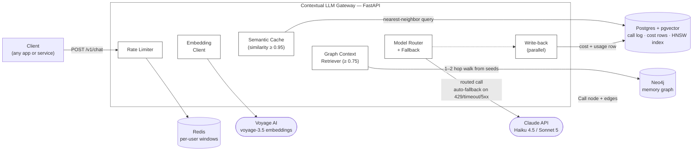
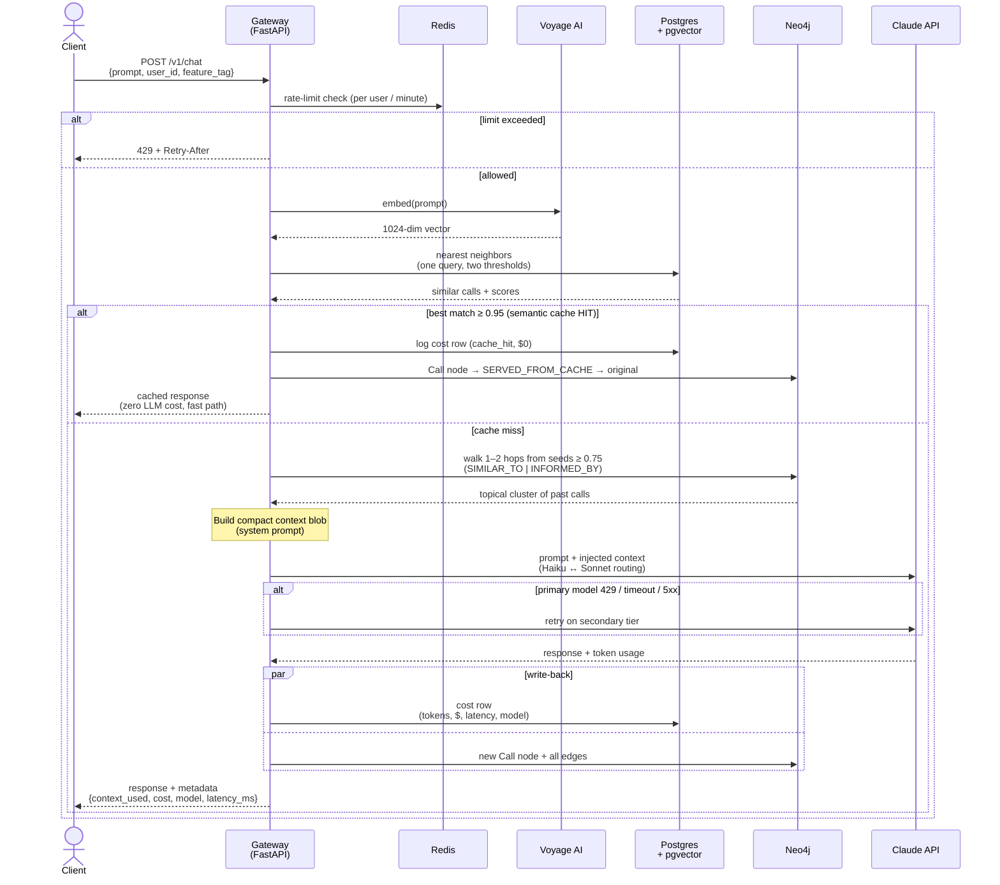

# Contextual LLM Gateway

An LLM gateway that doesn't just proxy and cache calls — it builds a **knowledge
graph of every call it handles** and feeds relevant history back into new calls,
so responses get better the more the system is used.

Most gateways are dumb pipes with a cache bolted on: request comes in, check
for an exact match, miss, forward, log. This one treats every call as a node in
a growing Neo4j graph — connected to the user who made it, the feature it came
from, the model that served it, and the semantically related calls that came
before it. A new prompt doesn't get a binary cache hit/miss: the gateway walks
the graph neighborhood of similar past calls and injects that context into the
request, so the LLM answers with awareness of related history it was never
explicitly given. Every response is then written back into the graph, so the
memory compounds.

**It's not a faster gateway — it's a gateway that makes the LLM smarter about
your domain the more it's used.**

> All diagrams below are Mermaid — GitHub renders them natively, and they work
> in VS Code's built-in Markdown preview.

---

## System architecture

Five backing services, one FastAPI process, each store doing the one thing it's
best at: Redis holds short-lived counters, pgvector does the vector math,
Neo4j does the relationship traversal, and the Claude API is reached through a
provider abstraction so a second provider can slot in without touching the
pipeline.


---

## The life of a request

One embedding call serves three purposes — cache lookup, graph seeding, and
write-back — so the "smart" path costs exactly one extra external call versus a
plain proxy. The sequence below is the entire pipeline
([app/pipeline.py](app/pipeline.py)):



---

## The memory graph

This is the data model that makes the system compound. `SIMILAR_TO` edges are
what let tomorrow's calls find today's; `INFORMED_BY` is the proof-of-value
edge — it records which past calls *actually* shaped a given answer, so you can
audit exactly where any response's grounding came from.

```mermaid
flowchart LR
    U["User"]
    C["Call<br/>(this request)"]
    C2["Call<br/>(past request)"]
    F["Feature"]
    M["Model"]
    P["Provider"]

    style U fill:#E8F0FE,stroke:#333
    style C fill:#FFF4E5,stroke:#333
    style C2 fill:#FFF4E5,stroke:#333
    style F fill:#E6F4EA,stroke:#333
    style M fill:#F3E8FD,stroke:#333
    style P fill:#FDE8E8,stroke:#333

    U -->|MADE| C
    C -->|TAGGED| F
    C -->|USED| M
    C -->|ROUTED_TO| P
    C -.->|FAILED_OVER_TO<br/>(only when fallback fired)| P
    C -->|SIMILAR_TO {score}<br/>(grows the memory)| C2
    C -->|INFORMED_BY<br/>(context actually injected)| C2
    C -.->|SERVED_FROM_CACHE {score}<br/>(cache hits, audit trail)| C2
```

Division of labor: **pgvector finds** (nearest-neighbor over embeddings — one
HNSW-indexed query returns both cache candidates and graph seeds), **Neo4j
connects** (from those seeds, a 1–2 hop walk pulls in follow-ups and sibling
calls that pure vector similarity misses). One embedding store, no duplication.

---

## Why this belongs in production

A gateway earns its place in a production stack by answering the questions
platform teams actually get asked — and the boring infra half of this project
is built for exactly those:

- **"What is the LLM costing us, and who's spending it?"** Every call writes a
  cost row attributed to user, feature, and day, priced from real token usage.
  `GET /v1/usage` is the finance answer, not an estimate.
- **"Why is the bill growing?"** The semantic cache (≥ 0.95) short-circuits
  near-duplicate prompts at zero LLM cost — in real products a meaningful slice
  of traffic is users asking the same thing in slightly different words.
- **"What happens when the provider has a bad day?"** Rate-limit errors,
  timeouts, and 5xxs auto-retry on the secondary model tier, and the failover
  is recorded (`FAILED_OVER_TO`) so degraded periods are visible after the fact.
- **"Can one noisy client take us down?"** Per-user rate limiting in Redis,
  with proper `429 + Retry-After` semantics.
- **"Can we audit what the model was told?"** Every response's metadata lists
  the exact `context_used` call IDs, and the graph stores `INFORMED_BY` edges —
  grounding is inspectable, not a black box.
- **Operationally boring in the good way** — one `docker compose up`, health
  checks on every service, all thresholds env-tunable, provider abstracted
  behind an interface so adding OpenAI is a subclass, not a rewrite.

### …and in a developer's daily life

The graph memory is what changes the day-to-day experience. Any team that
points repeated, domain-specific questions at an LLM hits the same wall: the
model knows the world, but not *your* world. This gateway closes that gap
passively — nobody curates a knowledge base; the knowledge base is the traffic:

- **Internal platform copilot** — engineers ask "how do I roll back?" about
  *your* deploy tool. After a few weeks of traffic the gateway answers with
  your bake times, your CLI commands, your gotchas (this is exactly what the
  demo simulates).
- **Support assistants that stop repeating themselves** — the hundredth ticket
  about an edge case gets answered with the context of the first ninety-nine.
- **Onboarding that compounds** — every question a new hire asks makes the next
  new hire's answers better, automatically.
- **Incident response** — "have we seen this error before?" is a graph
  neighborhood lookup, and the answer arrives already inside the LLM's context.

The `use_graph` / `use_cache` / `store` flags mean developers can A/B the
memory's value on their own traffic, benchmark the latency overhead, and keep
throwaway calls out of the graph — the system is measurable, not a leap of
faith.

### The honest tradeoff

This adds latency and cost per call versus a plain cache: an embedding call, a
pgvector query, a graph traversal, and a larger context all sit on the request
path, and injected context bills as input tokens. The value proposition is
**response quality on repeat/related domains, not raw speed**. If your traffic
is one-off, unrelated prompts, a plain semantic cache beats this design — and
the `use_graph` flag exists precisely so you can measure that on your own
traffic instead of taking it on faith.

**What's still missing before serious production use** (stated so nobody has
to discover it): authentication on the gateway itself, per-tenant isolation of
the memory graph (today the graph is shared — fine for a team tool, wrong for
multi-tenant SaaS), streaming responses, and PII policy for what gets persisted
into graph memory.

---

## Quickstart

```bash
cp .env.example .env      # fill in ANTHROPIC_API_KEY and VOYAGE_API_KEY
docker compose up --build
```

- Gateway: `http://localhost:8000` (interactive OpenAPI docs at `/docs`)
- Neo4j browser: `http://localhost:7474` (user `neo4j`, password `gatewaypass`)
  — open it during a demo to *show* the graph growing

Run the app outside Docker (infra still in containers):

```bash
docker compose up postgres neo4j redis
pip install -r requirements.txt
uvicorn app.main:app --reload
```

## API

### `POST /v1/chat`

```json
{
  "prompt": "How should I configure rollbacks?",
  "user_id": "u-42",
  "feature_tag": "deploys",
  "max_tokens": 700,
  "use_graph": true,
  "use_cache": true,
  "store": true
}
```

Response — the answer plus full gateway metadata:

```json
{
  "response": "...",
  "meta": {
    "call_id": "…",
    "cache_hit": false,
    "context_used": ["…call ids injected as context…"],
    "model": "claude-haiku-4-5",
    "provider": "anthropic",
    "fallback_used": false,
    "tokens_in": 812, "tokens_out": 304,
    "cost": 0.002332, "latency_ms": 1843
  }
}
```

| Flag | Effect |
|---|---|
| `use_graph: false` | bypass graph context — for A/B comparison |
| `use_cache: false` | skip the semantic-cache fast path |
| `store: false` | log cost only; keep the call out of graph memory |

### `GET /v1/usage?user_id=&feature_tag=`

Cost attribution rolled up by user / feature / day: calls, cache hits, tokens
in/out, dollar cost, average latency.

### `GET /v1/graph/stats`

Node and edge counts — watch the memory grow.

## The demo that lands

1. Seed ~35 related calls about a fictional internal platform ("Orbit" at
   Nimbus Labs). The domain facts live in the prompts — the way real users leak
   context into questions — so the graph absorbs them:

   ```bash
   python scripts/seed_demo.py
   ```

2. Ask a fresh question the seed data never answered directly — twice, graph
   off then graph on:

   ```bash
   python scripts/demo_compare.py
   ```

Without the graph, the model gives a generic "roll back your deploy" answer.
With it, the answer talks about flight numbers, the 8-minute bake time, the
config-revert gotcha, error-budget deploy gates — domain facts the caller never
put in the prompt. That side-by-side is the entire pitch in one screenshot.

Useful Neo4j browser query while demoing:

```cypher
MATCH (c:Call)-[r:SIMILAR_TO|INFORMED_BY]->(o:Call)
RETURN c, r, o LIMIT 100
```

## Tuning

All thresholds are environment variables (see `.env.example`): cache-hit
threshold (`0.95`), graph similarity threshold (`0.75`), context size and
snippet length, routing cutoff, rate limit per minute, model choices.

## Project layout

```
app/
  main.py        FastAPI app + endpoints
  pipeline.py    the request flow (rate limit → embed → cache → graph → LLM → write-back)
  providers.py   provider interface, Anthropic impl, routing + fallback, pricing
  db.py          Postgres: call log, pgvector search, usage rollups
  graph.py       Neo4j: write-back, 1–2 hop neighborhood expansion
  embeddings.py  Voyage AI client
  rate_limit.py  Redis fixed-window limiter
  config.py      env-driven settings
scripts/
  seed_demo.py     seed the graph with a fictional domain
  demo_compare.py  side-by-side: same question, graph off vs on
```
