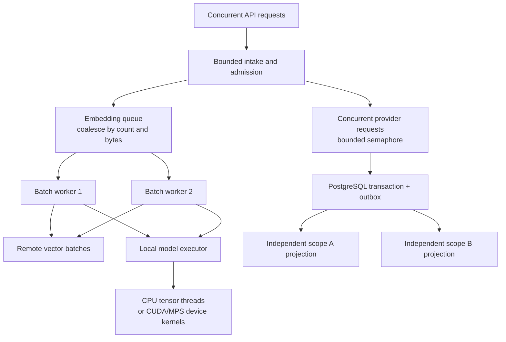

# Performance and accelerated embeddings

The implementation reduces avoidable overhead with bounded microbatches, pooled connections, reusable HTTP clients, limited concurrent work, and a scoped embedding cache. Exact completion hits use an indexed scoped query before embedding. PostgreSQL's HNSW index performs approximate vector search for other paths; Neo4j expands a bounded neighborhood. The gateway still incurs generation latency and context-token cost. Acceleration must be measured on the target machine and workload.

The [measured-results report](performance-results.md) records three CPU and three Apple MPS trials with a pinned MiniLM revision, raw JSON evidence, and explicit workload limits.

## Reproduce the batching mechanism

```bash
python scripts/benchmark_embeddings.py \
  --requests 256 --concurrency 64 \
  --output artifacts/embedding-synthetic.json
```

The default backend uses deterministic CPU vectors and **artificial fixed setup work per batch**. It compares batch size one against microbatching, verifies matching synthetic output fingerprints, and records backend calls, throughput, and latency percentiles. It needs no credentials, model downloads, or GPU. Its observed ratio describes the artificial batching workload only. It is not a measurement of Voyage, local model inference, LLM generation, or production traffic.

## Measure actual local inference

```bash
pip install -r requirements-acceleration.txt
python scripts/benchmark_embeddings.py \
  --backend local --device cpu \
  --model sentence-transformers/all-MiniLM-L6-v2 --dimension 384 \
  --requests 256 --concurrency 32 --batch-size 16 \
  --output artifacts/embedding-local-cpu.json
```

Pass `--revision <tested-immutable-model-commit>` to pin the local model used for a benchmark. Use `--device cuda` for a configured NVIDIA PyTorch runtime or `--device mps` for supported Apple hardware. An unavailable requested device is an error; it should not produce a report implying GPU measurements. Initial model loading and warmup are excluded. The command above measures one process with one embedding worker and memoization disabled; `--workers` makes other worker counts explicit. Latency starts after the benchmark's concurrency semaphore is acquired and includes the embedding client's queue; it is not full HTTP end-to-end latency.

Run several repetitions with an idle machine, record hardware and power settings, and vary prompt lengths, concurrency, batch size, and batching wait. GPU transfer and batching overhead can outweigh benefits at low load. Compare quality when changing embedding models as well as throughput.

For local inference inside Docker, an optional CPU override installs the acceleration dependency, provisions a model cache, and increases the memory budget:

```bash
docker compose -p gateway-local \
  -f docker-compose.yml -f docker-compose.acceleration.yml up --build -d
```

Use a fresh database because this override selects 384-dimensional local vectors. Stop any other local stack using the same ports first. Model weights can download on first launch; pre-stage approved weights for controlled environments. NVIDIA containers need the host runtime and GPU device configuration; Apple MPS is available to a native macOS process, not a Linux Docker container.

## Operating knobs

| Setting | Default | Main tradeoff |
|---|---:|---|
| `EMBEDDING_BATCH_SIZE` | 32 | Larger batches can improve throughput but increase per-batch memory. |
| `EMBEDDING_BATCH_MAX_BYTES` | 96000 | Splits batches by aggregate UTF-8 text bytes; oversized individual inputs still follow model context limits. |
| `LOCAL_EMBEDDING_CPU_THREADS` | 0 | Native framework default at zero; a positive value limits CPU inference threads. |
| `EMBEDDING_BATCH_WAIT_MS` | 5 | More coalescing adds waiting at low traffic. |
| `EMBEDDING_QUEUE_SIZE` | 512 | Larger queues absorb bursts but can hide overload until deadlines expire. |
| `EMBEDDING_WORKERS` | 2 | More workers increase backend concurrency; local device inference can serialize. |
| `EMBEDDING_CACHE_SIZE` | 2048 | Bounds resident reuse; private calls bypass it. |
| `PROVIDER_MAX_CONCURRENCY` | 32 | Bounds generation calls per process. |
| `MAX_CONCURRENT_REQUESTS` | 64 | Limits admitted requests per process. |
| `GRAPH_CONTEXT_LIMIT` | 6 | More context can improve coverage or introduce noise and token cost. |
| `GRAPH_CANDIDATE_POOL` | 24 | Larger neighborhoods increase traversal/ranking work. |
| `CONTEXT_MAX_CHARS` | 10000 | Caps injected text; characters are not an exact token budget. |

Each process has its own embedding cache, queue, provider circuits, and concurrency bounds. Multiplying replicas multiplies provider pressure and database pools. Redis rate windows are shared. The supplied Prometheus endpoint reports one process; run one application worker per container and scrape each replica, or introduce an explicitly configured multiprocess metrics design.

## Measure the complete service

Use the live evaluation for representative prompts, then a load generator with controlled arrival rate and request mix. Track exact-cache hits, uncached generation, graph use, and `store: false` paths separately. Capture p50/p95/p99 end-to-end latency, stage histograms, success/error counts, queue rejections, provider fallback, context size, token counts, outbox lag, CPU, memory, database connections, and cost estimates.

Warm and cold runs answer different questions. Specify which caches and model weights were warm, how long the trial ran, how arrivals were generated, which failures were excluded, and whether downstream quotas were reached. Avoid publishing a single throughput number without the error rate and latency distribution. No production throughput or latency SLO is claimed by the synthetic benchmark.

## Where parallel computing happens

The gateway uses several distinct kinds of parallel work. They have different resource limits and should be tuned separately.



Async request concurrency overlaps network waits. Embedding workers overlap independent remote batches; batching amortizes invocation overhead and supplies tensors large enough for efficient native computation. Local inference uses its dedicated executor and the framework's CPU thread pool or explicitly selected GPU device, keeping heavy computation off the API event loop. Increasing queue workers does not imply the same local model executes simultaneously on every worker.

Set `LOCAL_EMBEDDING_CPU_THREADS` deliberately when other processes share a machine; zero preserves the framework default. Avoid multiplying application replicas, embedding workers, and native CPU threads until they oversubscribe the host. The outbox processes independent scopes concurrently while maintaining order inside each scope. Readiness probes run concurrently because their database/Redis/graph reads are independent.

The embedding benchmark accepts `--workers` to compare independent batch concurrency and `--cpu-threads` to control native local CPU threads. It records the actual native thread count and checks per-item versus batched embedding agreement using cosine similarity and maximum component difference. Record worker count alongside batch size, CPU threads, model revision, and device. Compare one variable at a time. More parallelism can increase throughput while making tail latency, memory consumption, or provider throttling worse; monitor all four.


## Whole-gateway concurrency experiments

Run `python scripts/load_gateway.py --user YOUR_SCOPE --feature YOUR_FEATURE --mode graph --concurrency 1 8 32 64 --duration 30 --label "server hardware / generation / embedding model"`. Export `GATEWAY_API_KEY`; never put tokens in URLs. Seed representative memory first. Every measured request disables completion caching and new memory storage, but still commits content-free accounting. `--mode none` and `--mode vector` isolate retrieval costs. `--max-requests` bounds requests per profile; hitting it is explicit in the report. There are no client retries.

Workers run a closed loop until the duration or request cap ends. Throughput uses completed successes divided by total wall time, including final drain. p50/p95/p99 include the HTTP round trip and server work. Successful and all-attempt latency distributions, HTTP errors, malformed responses, model identities, token use and unpriced answers are recorded. The load generator constructs its connection pool before timing. Warmup request costs are recorded separately.

This method does not model independent arrivals or eliminate coordinated omission; it cannot establish arbitrary real-world saturation limits. Run multiple trials, shuffle profile order in repeated experiments, use realistic prompt-length distributions, measure time to first token separately for streaming, and record CPU/GPU utilization, memory, database connections and outbox lag. Keep the load generator off the measured host for production-capacity studies. Do not compare synthetic generation delays with live LLM capacity.
